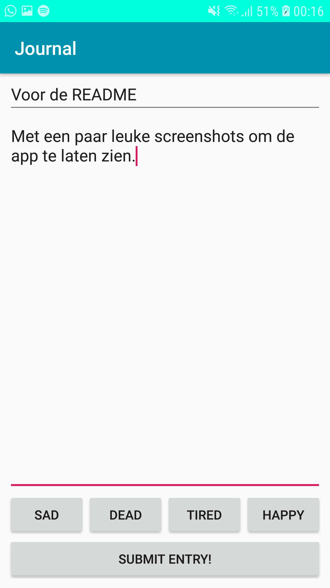
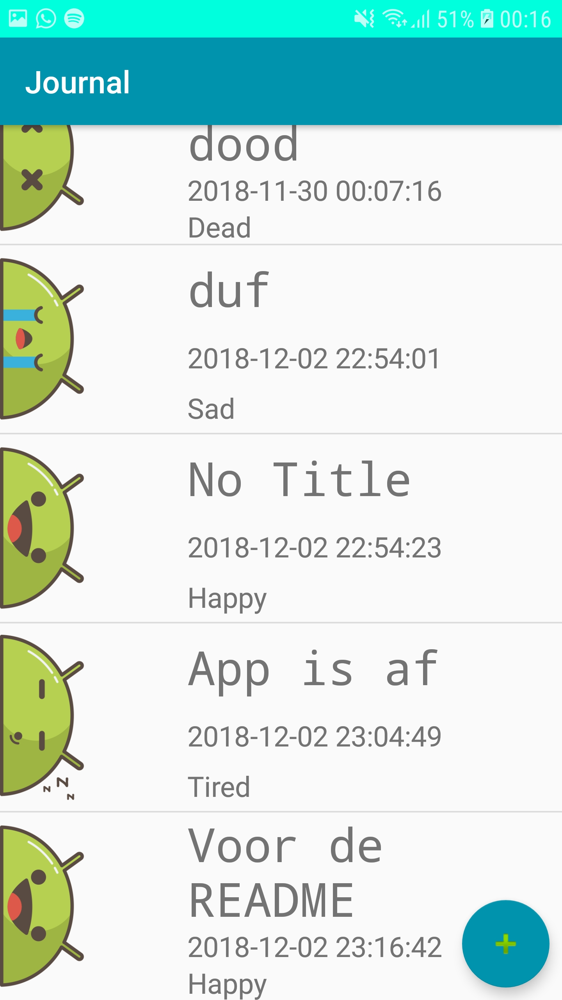
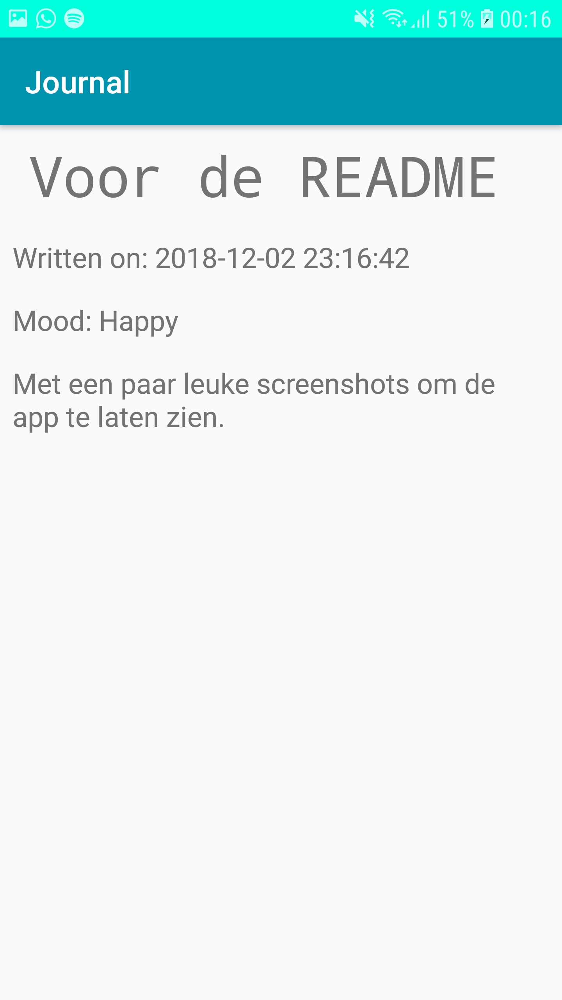

# Journal

This app let's you keep your very own Journal!

You will be able to create new entries which contain a title, the main story of what you want to put in your journal, and your 
emotional state which reflects how you feel about your journal entry. The time you write your entry will automatically be included
so you don't have to keep track of the time yourself!

After creating an entry, you'll be able to view every single one of your entries in detail by clicking on them in the main menu.
If you want to delete an entry, you simply have to click and hold the entry until it disappears.

 

